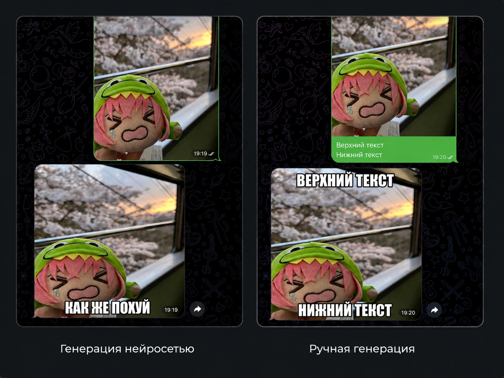

# Eggcel Bot

Telegram-бот, который превращает картинки в мемы "IMPACT" при помощи Gemini.  
Иногда получается смешно.

Рабочий пример бота [@eggcel_bot](https://t.me/eggcel_bot)


## Что он делает
- В ЛС юзер может создать свой мем из картинки и подписи.
- В одобренных чатах бот иногда генерирует мемы с помощью Gemini.
- Новые чаты проходят модерацию админами.

## Примеры


>[!NOTE]
> В примере использовался кастомный промпт.
---

## Команды
- `/start` - приветствие и прочая информация

### Админ-команды:
- `/add <chat_id>` - добавить чат
- `/remove <chat_id>` - отключить чат

---

## Запуск через Docker

1. Скопировать `.env.example` в `.env` и заполнить:
```bash
cp .env.example .env
```
2. Запустить:

```bash
docker compose up -d --build
```

 Посмотреть логи:
 ```bash
 docker compose logs -f
 ```

 ## Локальный запуск

```bash
uv sync
uv run python main.py
```

---

## Переменные окружения

| Переменная                | Обязательная | По умолчанию                         | Назначение |
|---                        |:---:    |---                                        |---         |
| `TELEGRAM_BOT_TOKEN`      | **да**  | --                                        | Токен Telegram-бота |
| `GEMINI_API_KEY`          | **да**  | --                                        | Ключ Gemini API |
| `ADMIN_IDS`               | **нет** | пустой список                             | Telegram ID админов через запятую. Если не указывать, админ-команды и модерация будут недоступны |
| `FONT_SOURCE`             | **нет** | `assets/fonts/default/Oswald-Bold.ttf`    | Путь к файлу или URL  [^font-source] |
| `DATABASE_URL`            | **нет** | SQLite: `data/database.db`                | URL подключение к базе данных |
| `GEMINI_MODEL`            | **нет** | `gemini-3.5-flash-lite`                   | Gemini модель |
| `MEME_PROMPT_PATH`        | **нет** | `assets/prompts/example.txt`              | Промпт для генерации |
| `MEME_STYLE_PATH`         | **нет** | `assets/prompts/meme_style.txt`           | Промпт-стили для генерации |
| `MEME_PROBABILITY`        | **нет** | `0.1`                                     | Вероятность реакции в групповом чате |
| `MEME_STYLE_PROBABILITY`  | **нет** | `0.33`                                    | Вероятность выбора стиля генерации. `0` для отключения [^meme-style-probability] |
| `LOG_TO_FILE`             | **нет** | `False`                                   | Записывать ли локальный `bot.log` |
| `WEBHOOK_URL`             | **нет** | не задано                                 | Публичный HTTPS-адрес. Если не задан, бот запускается через polling  |
| `WEBHOOK_PORT`            | **нет** | `8080`                                    | Локальный порт, на котором приложение принимает webhook-запросы |
| `WEBHOOK_PATH`            | **нет** | `telegram`                                | Путь webhook. Добавляется к `WEBHOOK_URL` |


[^font-source]: Из-за лицензионных ограничений я не могу оставить шрифт impact в самом репозитории.  
В `FONT_SOURCE` можно указать относительный путь к шрифту, либо прямую ссылку на шрифт.  
По умолчанию используется бесплатный шрифт "Oswald-Bold".

[^meme-style-probability]: Используется чтобы разнообразить ответы. С вероятностью указанной в `MEME_STYLE_PROBABILITY` случайным образом выбирает стиль генерации и добавляет его к промпту. Например: злой, добрый или саркостичный. Можно указать `0` для отключения или `1` чтобы стили всегда добавлялись.